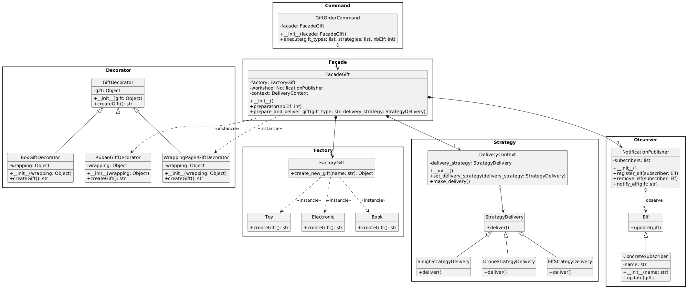

# 📌 Design Patterns en Python

## 🧠 Objectif

Ce dépôt a pour but de **présenter et implémenter les principaux Design Patterns en Python** à travers des exemples simples et pédagogiques.
Chaque pattern est illustré avec un cas concret autour d'un système de cadeaux (inspiré du Père Noël 🎅).

---

## 📂 Contenu du projet

### 🏗️ Patterns implémentés

| Pattern              | Fichier                 | Description                                               |
| -------------------- | ----------------------- | --------------------------------------------------------- |
| **Factory**          | `FactoryGift.py`        | Création d'objets sans exposer la logique d'instanciation |
| **Abstract Factory** | `FabriqueDuPereNoel.py` | Famille d'objets liés (usine de cadeaux)                  |
| **Command**          | `CommandGift.py`        | Encapsulation d'une action sous forme d'objet             |
| **Decorator**        | `DecoratorGift.py`      | Ajout dynamique de fonctionnalités à un objet             |
| **Facade**           | `FacadeGift.py`         | Interface simplifiée vers un système complexe             |
| **Observer**         | `ObserverGift.py`       | Notification automatique des observateurs                 |
| **Strategy**         | `StrategyGift.py`       | Sélection dynamique d'un algorithme                       |

---

## 🚀 Installation

1. Clone le dépôt :

```bash
git clone https://github.com/gaesty/designpatterns.git
cd designpatterns
```

2. Assure-toi d'avoir Python 3 installé :

```bash
python --version
```

---

## ▶️ Utilisation

Lance le programme principal qui orchestre tous les patterns :

```bash
py FabriqueDuPereNoel.py
```

Tu peux aussi exécuter chaque fichier individuellement pour tester un pattern spécifique :

```bash
py FactoryGift.py
py StrategyGift.py
py DecoratorGift.py
py CommandGift.py
py FacadeGift.py
py ObserverGift.py
```

---

## 📐 Diagrammes UML

### Diagramme de classes détaillé (PlantUML)

Ce diagramme présente l'ensemble des classes et leurs relations pour chaque Design Pattern utilisé :



### Diagramme de classes global

Vue d'ensemble de l'architecture du système avec la Facade comme point d'entrée :


---

## 🎓 Objectif pédagogique

Ce projet sert à :

* Comprendre les **Design Patterns GoF**
* Apprendre les bonnes pratiques de conception logicielle
* Illustrer des cas concrets en Python
* Fournir des exemples simples pour les étudiants ou développeurs débutants

---

## 🧩 Technologies

* Python 3
* Programmation Orientée Objet (POO)

[1]: https://github.com/gaesty/designpatterns "GitHub - gaesty/designpatterns"